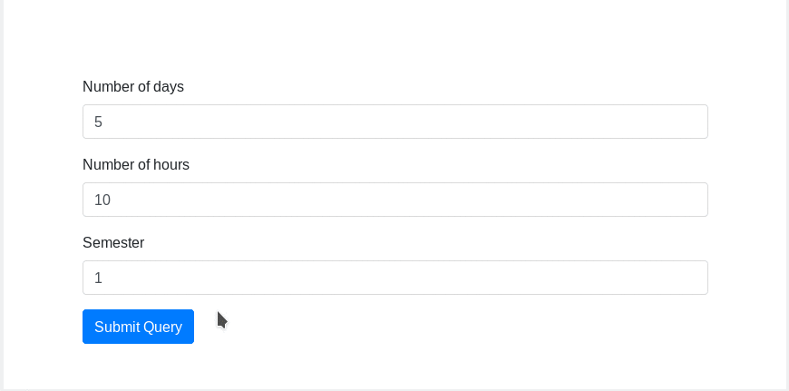

# TFG
Repositorio del Trabajo de Fin de Grado sobre la automatización de horarios




## How to use
Fill your data in Dataset directory (classrooms, groups and subjects).

In `djangoapp` directory run:
```shellsession
$ python manage.py makemigrations timetables
$ python manage.py migrate
$ python store_csv.py ../Dataset/classrooms.csv Classroom ../Dataset/subjects.csv Subjects ../Dataset/groups.csv Groups
$ python manage.py runserver
```
Must be runned with **Python 3**
